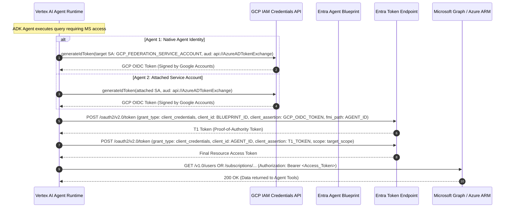

# Multi-Cloud Identity & Token Federation Architecture

This repository demonstrates enterprise multi-cloud agent interoperability between **Google Cloud Vertex AI Agent Runtime (Agent Engine)** and **Microsoft Entra ID / Microsoft Graph & Azure ARM**.

---

## 1. Authentication Flow Overview

---

## 2. Comparison: Agent 1 vs Agent 2

| Dimension | Agent 1: Native GCP Agent Identity | Agent 2: Attached GCP Service Account |
| :--- | :--- | :--- |
| **GCP Runtime Identity** | Native Agent Identity (`spec.identity_type = AGENT_IDENTITY`) | User-managed Service Account (`spec.service_account = SA`) |
| **GCP Token Acquisition** | Native Agent Identity impersonates the target Federation SA (`generateIdToken`) | Attached SA generates its own OIDC ID Token directly (`generateIdToken`) |
| **Azure FIC Target** | Subject matches the Federation SA Unique ID | Subject matches the Attached SA Unique ID |
| **Entra Agent ID Token Flow** | 2-step Blueprint + Agent ID Token Exchange | 2-step Blueprint + Agent ID Token Exchange |
| **Model** | `gemini-3.7-flash` | `gemini-3.7-flash` |

---

## 3. Microsoft Entra Configuration Details

### A. Agent Identity Blueprint
- **Object Type:** `Microsoft.Graph.AgentIdentityBlueprint`
- **Federated Identity Credential (FIC):**
  - **Issuer:** `https://accounts.google.com`
  - **Subject:** `<GCP_SERVICE_ACCOUNT_UNIQUE_NUMERIC_ID>`
  - **Audience:** `api://AzureADTokenExchange`

### B. Entra Agent ID
- **Object Type:** `Microsoft.Graph.AgentIdentity`
- **Linkage:** Associated with the Agent Identity Blueprint (`appId: <BLUEPRINT_ID>`).
- **Permissions:**
  - **Entra Directory Role:** `Directory Readers` (allows reading Microsoft Graph users/groups).
  - **Azure Subscription RBAC:** `Reader` (on Azure Subscription or specific Resource Groups).
