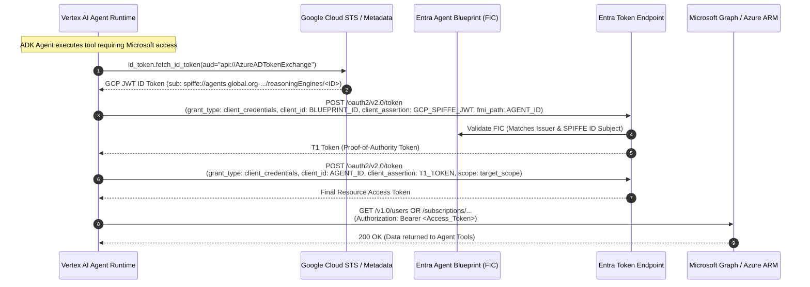

# Multi-Cloud Identity & Token Federation Architecture

This repository demonstrates enterprise multi-cloud agent interoperability between **Google Cloud Vertex AI Agent Runtime (Agent Engine)** and **Microsoft Entra ID / Microsoft Graph & Azure ARM**.

---

## 1. Native Agent Identity (SPIFFE ID) Direct Federation (Primary & Recommended)

Google Cloud Vertex AI Agent Runtime assigns a native, strongly attested **Agent Identity** (`spiffe://...`) to the deployed agent. The agent runtime directly mints a Google-signed OIDC JSON Web Token (JWT) bearing the agent's unique SPIFFE ID as the `sub` claim. 

Microsoft Entra ID's **Agent Identity Blueprint** validates this JWT via a **Federated Identity Credential (FIC)** configured with the agent's SPIFFE ID as the Subject.

### Sequence Diagram

### Token Claim Details

* **`iss` (Issuer):** `https://sts.googleapis.com/v1/organizations/{ORG_ID}/locations/global/workloadIdentityPools/agents.global.org-{ORG_ID}.system.id.goog`
* **`sub` (Subject):** `spiffe://agents.global.org-{ORG_ID}.system.id.goog/resources/aiplatform/projects/{PROJECT_NUMBER}/locations/{LOCATION}/reasoningEngines/{REASONING_ENGINE_ID}`
* **`aud` (Audience):** `api://AzureADTokenExchange`

---

## 2. Architectural Comparison: Direct SPIFFE vs. Legacy Service Account Patterns

| Dimension | Native Agent Identity (Direct SPIFFE) ⭐ Recommended | Legacy Option 1: Agent Identity + SA Impersonation | Legacy Option 2: Directly Attached Service Account |
| :--- | :--- | :--- | :--- |
| **Location in Repo** | `agent/` | `legacy/agent_with_agent_identity/` | `legacy/agent_with_service_account/` |
| **GCP Runtime Identity** | Native Agent Identity (`identity_type = AGENT_IDENTITY`) | Native Agent Identity (`identity_type = AGENT_IDENTITY`) | User-managed Service Account (`spec.service_account = SA`) |
| **GCP Token Acquisition** | Direct OIDC ID Token from ambient runtime (`id_token.fetch_id_token`) | Impersonates intermediate Service Account via IAM Credentials API | Attached SA mints token directly via IAM Credentials API |
| **GCP Service Account Needed?** | ❌ **No Service Account needed** | ✔️ Yes (requires `iam.serviceAccountOpenIdTokenCreator`) | ✔️ Yes (attached directly to Agent Engine) |
| **Azure FIC Issuer** | `https://sts.googleapis.com/v1/organizations/{ORG_ID}/locations/global/workloadIdentityPools/agents.global.org-{ORG_ID}.system.id.goog` | `https://accounts.google.com` | `https://accounts.google.com` |
| **Azure FIC Subject** | Agent's native `spiffe://` URI | Service Account Unique Numeric ID | Service Account Unique Numeric ID |
| **Model** | `gemini-3.7-flash` | `gemini-3.7-flash` | `gemini-3.7-flash` |

---

## 3. Microsoft Entra Configuration Details

### A. Agent Identity Blueprint
* **Object Type:** `Microsoft.Graph.AgentIdentityBlueprint`
* **Federated Identity Credential (FIC):**
  * **Credential Type:** Other issuer
  * **Issuer:** `https://sts.googleapis.com/v1/organizations/{ORG_ID}/locations/global/workloadIdentityPools/agents.global.org-{ORG_ID}.system.id.goog`
  * **Subject:** `spiffe://agents.global.org-{ORG_ID}.system.id.goog/resources/aiplatform/projects/{PROJECT_NUMBER}/locations/{LOCATION}/reasoningEngines/{REASONING_ENGINE_ID}`
  * **Audience:** `api://AzureADTokenExchange`

### B. Entra Agent ID
* **Object Type:** `Microsoft.Graph.AgentIdentity`
* **Linkage:** Associated with the Agent Identity Blueprint (`appId: <BLUEPRINT_ID>`).
* **Permissions:**
  * **Entra Directory Role:** `Directory Readers` (allows reading Microsoft Graph users/groups).
  * **Azure Subscription RBAC:** `Reader` (on Azure Subscription or specific Resource Groups).
